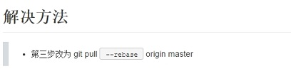
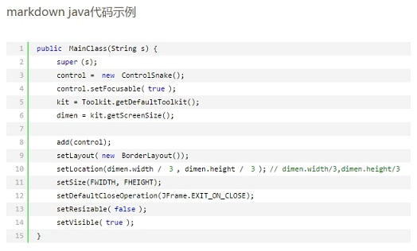
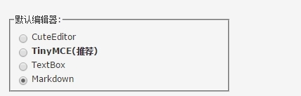

# 博客园定制CSS与页脚Javascript

## 1.写在前面

> * [博客园](http://www.cnblogs.com/gzdaijie/)自带的markdown样式较为简洁，因此想定制博客样式。
> * style.css文件修改自[huizhong](https://github.com/huizhong/cnblogs-markdown-css)，特表示感谢。

## 2.主要改变

> * 自定义博客园markdown渲染样式
> * 博客园markdown代码没有行号，使用`SyntaxHighlighter`插件重新渲染代码部分，详见[footer.js](./footer.js)，`SyntaxHighlighter`插件博客园已支持。
> * 更多变化可以参考[我的博客](http://www.cnblogs.com/gzdaijie/p/5187171.html)

### 示例如下

## 3.使用方法

> * 将[style.css](./style.css)的代码复制到[博客园后台管理](http://i.cnblogs.com/Configure.aspx)的`页面定制CSS代码`中。
> * 将[footer.js](./footer.js)的代码复制到[博客园后台管理](http://i.cnblogs.com/Configure.aspx)的`页脚Html代码`中。
> * 在[编辑器设置](http://i.cnblogs.com/Preferences.aspx)中设置默认编辑器为`Markdown`

